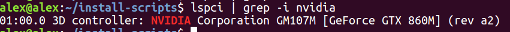
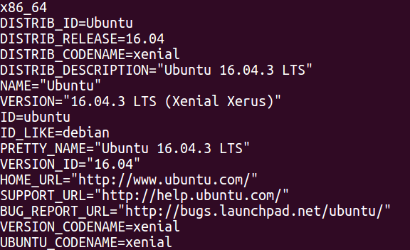
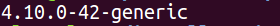
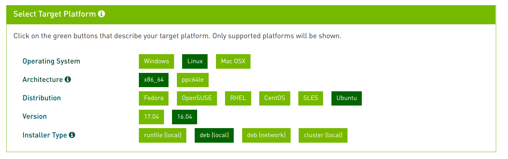
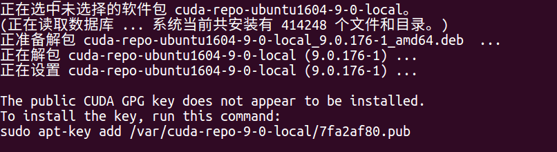
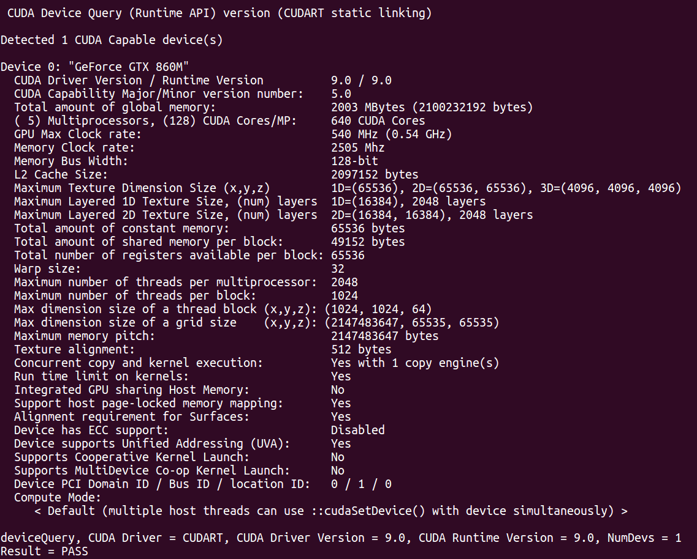

# 1. 检查显卡是否支持CUDA

```bash
lspci | grep -i nvidia
```



结果显示显卡型号为GeForce GTX 860M,在[支持CUDA的显卡列表]( http://developer.nvidia.com/cuda-gpus)能够找到这个型号的显卡，说明支持CUDA

# 2. 检查软件环境

安装钱需要检查系统是否满足CUDA9.0的软件要求。
下图是Nvidia发布的CUDA9.0对于软件环境的要求:

发现当前系统在列表中。

## 2.1. 查看系统信息

``` bash
uname -m && cat /etc/*release
```


结果表示版本是16.04.3的64(第一行的“x86_64”)位ubuntu系统。

## 2.2. 检查内核版本

```bash
uname -r
```



## 2.3. 检查gcc版本

```bash
gcc --version
```


结果显示gcc版本为5.4.0

_如果结果显示找不到gcc，使用命令安装gcc_

```bash
suduo apt-get install build-essenntial
```

## 2.4 安装linux kernel headers 和 开发包

```bash
sudo apt-get install linux-headers-$(uname -r)
```

# 3. 下载并CUDA
在[CUDA官方下载页面](https://developer.nvidia.com/cuda-downloads)中选择要下载的版本下载.


下载完成后,找到下载的deb文件所在目录，执行命令

```bash
sudo dpkg -i cuda-repo-ubuntu1604-9-0-local_9.0.176-1_amd64.deb 
```

首次执行这个命令时会在结果的最后三行提示添加public GUDA GPG的key


执行命令添加Key

```bash
sudo apt-key add /var/cuda-repo-9-0-local/7fa2af80.pub
```

然后执行命令真正安装cuda

```bash
sudo apt-get update
sudo apt-get install cuda
```

# 4. 配置CUDA

在~/.bashrc 中增加如下命令，以配置环境变量

```bash
export PATH=/usr/local/cuda-9.0/bin${PATH:+:${PATH}}
export LD_LIBRARY_PATH=/usr/local/cuda-9.0/lib64${LD_LIBRARY_PATH:+:${LD_LIBRARY_PATH}}
```

# 5. 验证

## 5.1 安装cuda sample

执行命令

```bash
cuda-install-samples-9.0.sh ~/cuda_samples
```

这个命令会将在目录 ~/cuda_samples/ 中安装一个叫做 NVIDIA_CUDA-9.0_Samples 目录，进入这个目录，然后执行 

```bash
make -j8
```

执行完毕后，在bin目录或者bin的子目录中找到并执行 deviceQuery 文件。
